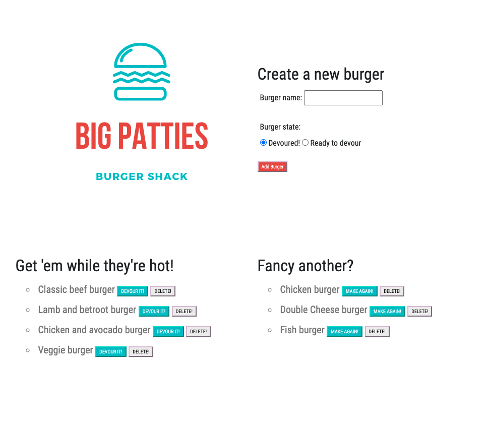

#Burger tracker

Format: 

http://github.com - automatic!
[GitHub](http://github.com)

This app logs burgers and used MySQL, Node, Express, Handlebars and an ORM.
I have used an MVC structure.

## Installation

Please run *npm install* within the terminal to install the dependencies

## Usage 

The burger logger is a restaurant application that enables users to create a burger and place it in a waiting area.

The user can then mark a burger as devoured and request to remake a burger once it appears within the "devoured" list.

The app stores all burgers created within a MySQL database.

## Credits

I used Canva.com to create the logo

## License

MIT License

